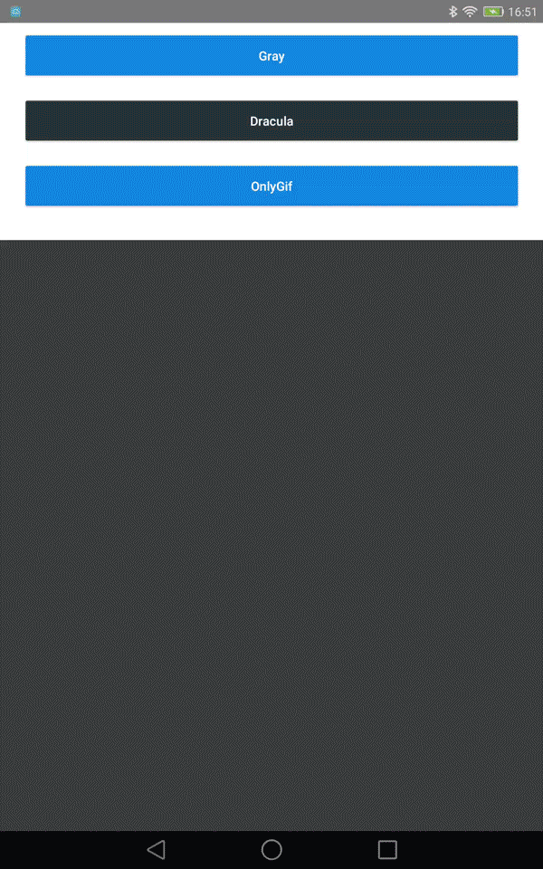

# MediaSelector
Android本地图片与视频选择库，支持拍照选择，支持限定文件数量、类型，支持图片预览，目前不包含图片裁剪功能，后期考虑扩展。图片加载引擎支持常规的Glide、Fresco、Picasso。

## 效果图



## 使用
```
                Selector.from(SampleActivity.this)
                        .choose(MimeType.ofImage())
                        .theme(R.style.Matisse_Dracula)
                        .countable(false)
                        .addFilter(new GifSizeFilter(320, 320, 5 * Filter.K * Filter.K))
                        .maxSelectable(9)
                        .originalEnable(true)
                        .thumbnailScale(0.75f)
                        .gridExpectedSize(
                                getResources().getDimensionPixelSize(R.dimen.grid_expected_size))
                        .maxOriginalSize(10)
                        .restrictOrientation(ActivityInfo.SCREEN_ORIENTATION_PORTRAIT)
                        .imageEngine(new FrescoEngine())
                        .forResult(REQUEST_CODE_CHOOSE);
```
在Activity或者Fragment的onActivityResult中接收选择的项目，更多使用请参考demo中的代码。

## 特别感谢

[知乎Matisse](https://github.com/zhihu/Matisse)
本库绝大部分代码是从知乎Matisse库中迁移过来，主要的改动为：
1. 弃用了古老的Loader加载方式，改用基于RxJava封装的异步Album与Media加载方式
2. 新增了Fresco加载图片支持，目前支持Glide、Picasso和Fresco
3. 图片预览缩放页面弃用了ImageTouch控件，改用PhotoView
4. Cursor使用优化

## 引入

```
implementation 'com.zcy:selector:1.0.0'
```